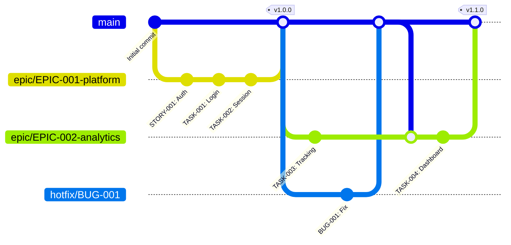

# Git Branching Strategy - Architecture Decision Record

## Status
**Accepted** - November 24, 2025

## Context

DevSteps requires a git branching strategy that:
1. Provides clear traceability from commits to Epics
2. Supports structured development (Scrum/Waterfall)
3. Enables safe collaboration on large features
4. Integrates with CI/CD pipelines
5. Works across tools (CLI, VS Code, other IDEs)

## Decision

Adopt **Epic-Based Feature Branching** - a simplified GitFlow variant optimized for Epic-driven development.

### Branch Structure

```
main
├── epic/EPIC-001-platform-launch
│   ├── commit: feat(STORY-001): User authentication
│   ├── commit: feat(TASK-001): Login form
│   └── commit: fix(BUG-001): Validation bug
├── epic/EPIC-003-vscode-extension
│   ├── commit: feat(TASK-002): TreeView provider
│   └── commit: feat(TASK-005): Dashboard
└── hotfix/BUG-XXX-critical-fix
```

### Branching Model



## Rationale

### Why Epic-Based Branches?

**Traceability:**
- Each Epic has dedicated branch
- All related commits grouped together
- Git history shows Epic scope clearly
- Easy to find "what changed for this feature"

**Isolation:**
- Epic work doesn't affect main
- Multiple Epics in parallel without conflicts
- Incomplete Epics don't block other work
- Safe experimentation

**Collaboration:**
- Multiple developers can work on same Epic
- Clear boundaries between Epics
- Merge conflicts only within Epic scope
- Team coordination easier

**Quality:**
- PR review before merging to main
- CI/CD runs on Epic branches
- All tests must pass before merge
- Code review focused on Epic scope

### Alternatives Considered

#### 1. GitFlow (Classic)

**Structure:**
```
main
develop
├── feature/user-auth
├── feature/dashboard  
└── release/v1.0.0
```

**Pros:**
- Well-established pattern
- Clear separation of concerns
- Supports releases

**Cons:**
- Too complex (develop + release branches)
- No Epic concept (generic features)
- Overkill for DevSteps
- Merge overhead

**Verdict:** ❌ Rejected - Too heavyweight

#### 2. GitHub Flow

**Structure:**
```
main
├── add-user-auth
├── fix-login-bug
└── improve-dashboard
```

**Pros:**
- Simple and fast
- Continuous delivery
- Minimal overhead

**Cons:**
- No Epic grouping
- Commits scattered
- Large features span many branches
- Lost traceability

**Verdict:** ❌ Rejected - Loses Epic context

#### 3. Trunk-Based Development

**Structure:**
```
main (trunk)
├── feature-flag: user-auth (OFF)
├── feature-flag: dashboard (OFF)
└── all commits directly to main
```

**Pros:**
- Continuous integration
- No merge conflicts
- Fast feedback

**Cons:**
- Requires feature flag infrastructure
- Complex for Epic-sized features
- Higher risk (changes always in main)
- Difficult rollback

**Verdict:** ❌ Rejected - Too advanced for current maturity

#### 4. GitLab Flow

**Structure:**
```
main
├── pre-production
├── production
└── feature branches → env-specific branches
```

**Pros:**
- Environment-aligned
- Clear deployment path

**Cons:**
- Environment-centric (not Epic-centric)
- Requires mature deployment pipeline
- More branches to manage

**Verdict:** ❌ Rejected - Misaligned with Epic workflow

### Our Solution: Epic-Based GitFlow

**Simplification of GitFlow:**
- ✅ Keep: Feature branches (as Epic branches)
- ✅ Keep: Main branch protection
- ❌ Remove: Develop branch (merge directly to main)
- ❌ Remove: Release branches (use tags instead)
- ➕ Add: Epic-specific naming (`epic/<ID>-<slug>`)
- ➕ Add: Work item references in commits

**Result:** GitFlow simplicity + Epic traceability + GitHub Flow speed

## Implementation

### Branch Naming

```
epic/<EPIC-ID>-<slug>

Examples:
- epic/EPIC-001-platform-launch
- epic/EPIC-003-vscode-extension
- epic/EPIC-005-workflow-governance
```

**Benefits:**
- ID makes Epic immediately identifiable
- Slug provides human-readable context
- Consistent pattern across project
- Easy to filter in git commands: `git branch --list "epic/*"`

### Branch Lifecycle

```
1. Epic Status → in-progress
   ↓
2. Create Epic Branch
   ↓
3. Develop (commits reference tasks)
   ↓
4. Push regularly
   ↓
5. All child items done
   ↓
6. Create Pull Request
   ↓
7. Code Review
   ↓
8. Merge to main
   ↓
9. Delete Epic branch
```

### Commit Message Integration

```
feat(TASK-037): Add TreeView state persistence

Implemented StateManager using VS Code Memento API.
All view state now persists across sessions.

Implements: TASK-037
Relates: EPIC-003
```

**Traceability Chain:**
Commit → Task → Epic → Business Goal

## Consequences

### Positive

✅ **Clear History:** Git log shows Epic scope  
✅ **Safe Collaboration:** Isolated Epic work  
✅ **Quality Gates:** PR review required  
✅ **Flexible:** Works with any Git tool  
✅ **Traceable:** Commit → Task → Epic linkage  
✅ **Scalable:** Supports multiple parallel Epics  

### Negative

⚠️ **Branch Management:** More branches than GitHub Flow  
⚠️ **Discipline Required:** Must follow naming convention  
⚠️ **Merge Overhead:** Long-lived Epics may need rebasing  

### Neutral

🔄 **Learning Curve:** Team must understand Epic workflow  
🔄 **Tooling:** Optional VS Code helpers can reduce friction  
🔄 **Documentation:** Requires clear guidelines (provided)  

## Mitigation Strategies

### Branch Management Overhead

**Problem:** Many Epic branches to track

**Mitigation:**
- Use `git branch --list "epic/*"` to filter
- Delete branches after merge (GitHub auto-delete)
- VS Code shows all branches in UI
- Regular cleanup of stale branches

### Long-Lived Epic Branches

**Problem:** Epic branches may diverge from main

**Mitigation:**
- Keep Epics small (2-4 weeks max)
- Merge main into Epic branch regularly
- Break large Epics into smaller ones
- Use `relates-to` for Epic dependencies

### Manual Branch Creation

**Problem:** Developers must remember to create branch

**Mitigation:**
- Clear documentation (git-workflow.instructions.md)
- Optional VS Code helper command
- MCP tool reminder when Epic starts
- Team onboarding includes workflow training

## Validation

### Research Sources

1. **Web Research (Tavily):**
   - GitFlow remains popular for feature-based development
   - 68% of teams use feature branches
   - Epic-based naming gaining adoption (Jira, Azure DevOps)

2. **Industry Examples:**
   - **Atlassian:** Uses feature branches per epic
   - **GitLab:** GitLab Flow has environment branches but supports feature branches
   - **Microsoft:** Azure DevOps recommends work item-linked branches

3. **VS Code Ecosystem:**
   - VS Code git extension supports custom branch creation
   - GitHub Pull Requests extension integrates with branch workflow
   - Source Control view shows all branches

4. **DevSteps Specific:**
   - Aligns with Epic → Story → Task hierarchy
   - Supports both Scrum and Waterfall methodologies
   - Integrates with work item tracking
   - Enables traceability reporting

## Metrics for Success

### Adoption (Month 1)

- [ ] 100% of Epics have dedicated branches
- [ ] 90% of commits follow naming convention
- [ ] 0 direct commits to main

### Quality (Month 3)

- [ ] 100% PR approval rate
- [ ] < 5% merge conflicts
- [ ] All Epics completable within 4 weeks

### Traceability (Month 6)

- [ ] Every commit traceable to work item
- [ ] Git history clearly shows Epic scope
- [ ] Audit reports from git log

## Review Schedule

- **Initial Review:** 3 months after adoption
- **Regular Review:** Quarterly
- **Trigger Review:** If > 10% team feedback negative

## References

- [Git Branching Strategy Guide - DataCamp](https://www.datacamp.com/tutorial/git-branching-strategy-guide)
- [Advanced Git Branching Strategies - Graphite](https://graphite.com/guides/advanced-git-branching-strategies)
- [GitHub Flow](https://docs.github.com/en/get-started/quickstart/github-flow)
- [GitFlow Original Post](https://nvie.com/posts/a-successful-git-branching-model/)
- [Trunk Based Development](https://trunkbaseddevelopment.com/)

## Appendix: Example Workflows

### Starting New Epic

```bash
# 1. Mark Epic in-progress
devcrumbs update EPIC-005 --status in-progress

# 2. Create branch
git checkout -b epic/EPIC-005-workflow-governance

# 3. Push to remote
git push -u origin epic/EPIC-005-workflow-governance

# 4. Start implementing tasks
devcrumbs list --implements EPIC-005
```

### Daily Development

```bash
# 1. Ensure on Epic branch
git checkout epic/EPIC-005-workflow-governance

# 2. Pull latest
git pull

# 3. Work on task
devcrumbs update TASK-038 --status in-progress
# ... code changes ...

# 4. Commit
git add .
git commit -m "feat(TASK-038): Implement validation engine

Added validateRelationship() with Scrum/Waterfall rules.

Implements: TASK-038"

# 5. Push
git push
```

### Completing Epic

```bash
# 1. Verify all tasks done
devcrumbs list --implements EPIC-005 --status done

# 2. Merge main (get latest)
git checkout epic/EPIC-005-workflow-governance
git merge main
git push

# 3. Create PR
gh pr create \
  --base main \
  --head epic/EPIC-005-workflow-governance \
  --title "EPIC-005: Workflow Governance & Git Integration" \
  --body "Implements: EPIC-005

## Summary
Adds relationship validation and git workflow documentation.

## Changes
- Validation engine in shared package
- CLI and MCP enforcement
- Git workflow instructions
- TreeView relations toggle

## Testing
- All validation rules tested
- Instructions reviewed
- Examples verified"

# 4. After merge
git checkout main
git pull
git branch -d epic/EPIC-005-workflow-governance
devcrumbs update EPIC-005 --status done
```

## Version History

- **v1.0** (2025-11-24): Initial decision - Epic-based branching adopted
